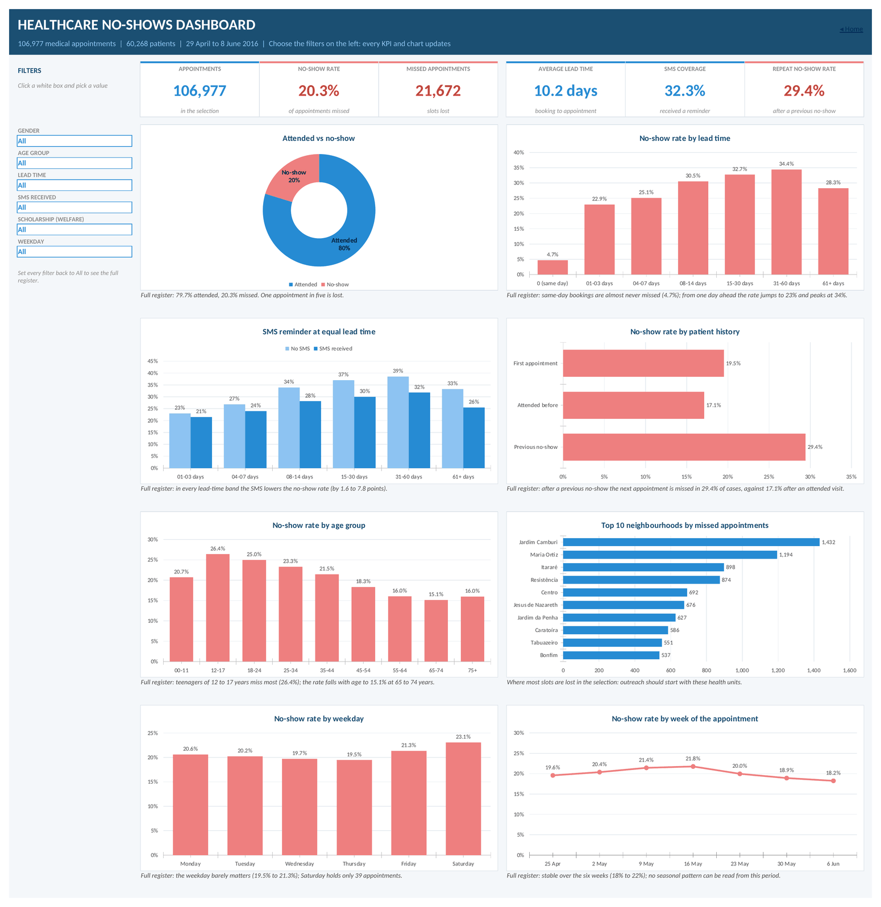
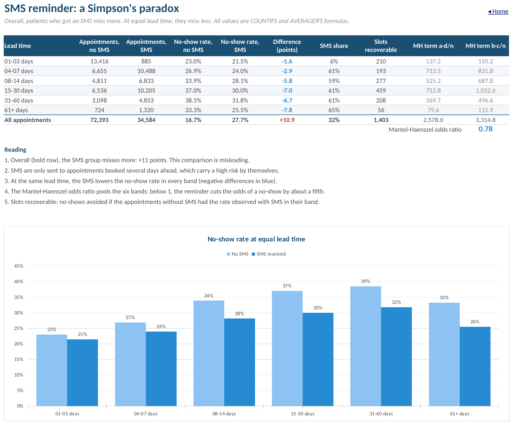
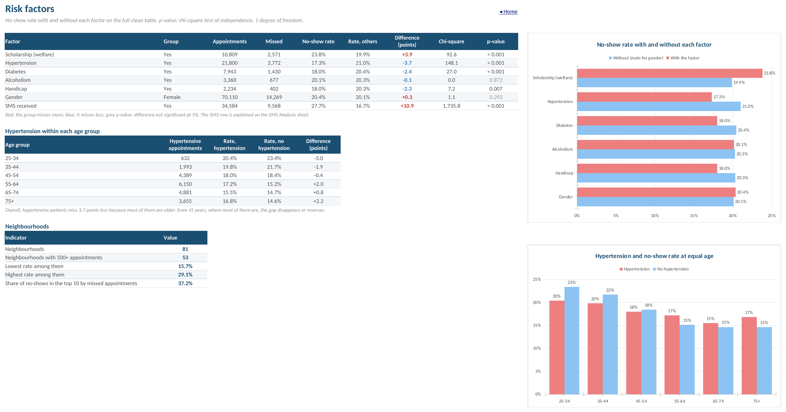
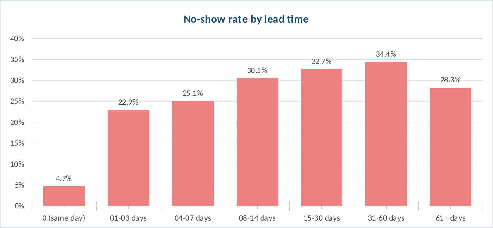
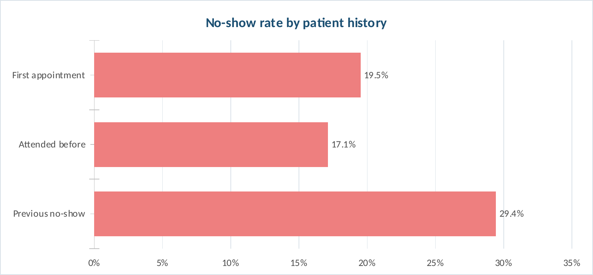
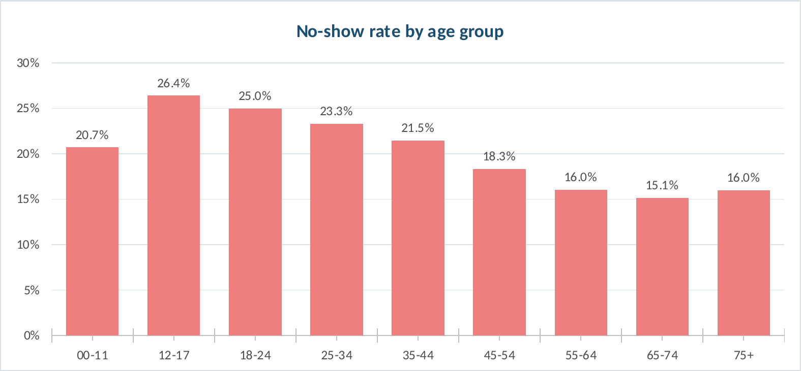
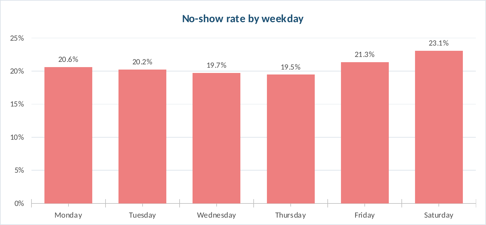
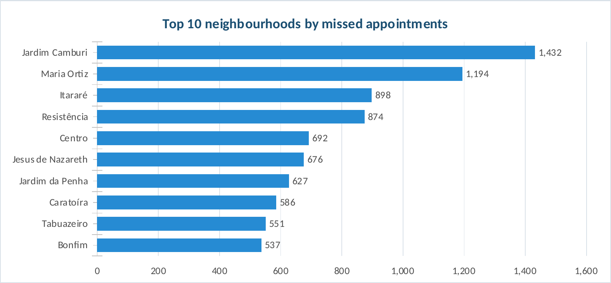
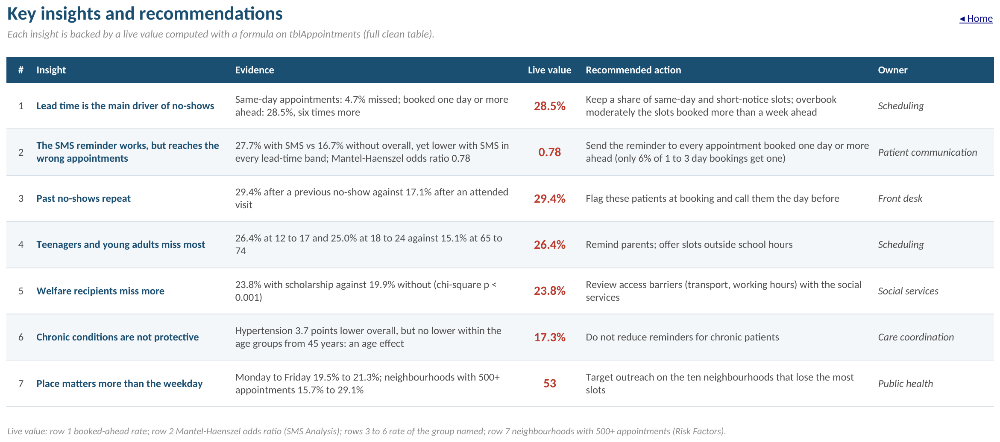

# 🏥 Healthcare No-Shows Analytics

### Data Cleaning · KPI Engineering · Statistical Analysis · Interactive Excel Dashboard

<p align="center">
  
  
  
  
</p>

<p align="center">
  <strong>Understanding healthcare appointment no-shows through data quality, KPI engineering and statistical analysis.</strong>
</p>

---

## 📊 Project Snapshot

|                            |               |
| -------------------------- | ------------: |
| **Raw appointments**       |       106,987 |
| **Validated appointments** |       106,977 |
| **Patients**               |        60,268 |
| **Missed appointments**    |        21,672 |
| **No-show rate**           |     **20.3%** |
| **Attendance rate**        |     **79.7%** |
| **Average lead time**      | **10.2 days** |
| **SMS coverage**           |     **32.3%** |

**Observation period:** 29 April – 8 June 2016

---

## 🎯 Overview

**Healthcare No-Shows Analytics** is an end-to-end healthcare data analysis project developed entirely in **Microsoft Excel**.

The project transforms a raw appointment dataset into a structured analytical workbook combining:

* Data cleaning and validation
* Feature engineering
* KPI development
* Statistical analysis
* Interactive dashboards
* Patient-behaviour analysis
* Evidence-based insights

The central question is simple:

> **What patterns are associated with missed medical appointments, and how can they be identified through reliable data analysis?**

---

## 🔄 Analytical Workflow

```text
Raw Appointment Data
        ↓
Data Quality Audit
        ↓
Cleaning & Validation
        ↓
Feature Engineering
        ↓
KPI Engineering
        ↓
Statistical Analysis
        ↓
Insight Generation
        ↓
Interactive Dashboard
```

---

# 🧹 Data Quality & Preparation

The raw dataset contains **106,987 appointments across 15 columns**.

A structured audit was performed before building the dashboard.

### Data-quality issues identified

| Issue                      | Records | Treatment         |
| -------------------------- | ------: | ----------------- |
| Appointment before booking |       5 | Removed           |
| Age recorded as 115        |       5 | Removed           |
| Empty cells                |       0 | No action         |
| Duplicate Appointment IDs  |       0 | No action         |
| Incorrect date differences |       0 | No action         |
| Decimal Patient IDs        |       5 | Preserved as text |

After validation:

> **106,977 appointments and 60,268 patients remain in the analytical dataset.**

The cleaned table contains **23 columns**, including **9 computed analytical fields**.

---

## 🧮 Engineered Variables

The cleaned dataset introduces variables designed specifically for behavioural and operational analysis:

* `NoShow`
* `LeadTimeDays`
* `LeadTimeBand`
* `AgeGroup`
* `Weekday`
* `WeekStart`
* `SMSFlag`
* `PriorNoShows`
* `PatientHistory`

These variables provide the foundation for the dashboard and statistical analysis.

---

# 📈 Key Performance Indicators

| KPI                                 |         Value |
| ----------------------------------- | ------------: |
| Appointments                        |   **106,977** |
| Missed appointments                 |    **21,672** |
| No-show rate                        |     **20.3%** |
| Attendance rate                     |     **79.7%** |
| Average lead time                   | **10.2 days** |
| Same-day appointments               |     **34.7%** |
| SMS coverage                        |     **32.3%** |
| No-show rate — booked ≥ 1 day ahead |     **28.5%** |
| Repeat no-show rate                 |     **29.4%** |

All KPI definitions and formulas are documented in the **KPI Definitions** worksheet.

---

# 🔎 Key Insights

### 01 · Lead Time

Same-day appointments have a **4.7% no-show rate**, compared with **28.5%** for appointments booked at least one day in advance.

Lead time is therefore a major differentiating factor in the observed appointment data.

---

### 02 · SMS Reminders

A direct comparison of SMS and non-SMS appointments can be misleading because SMS reminders are concentrated among appointments with longer lead times.

After comparing appointments within the same lead-time bands, the analysis reports a:

**Mantel–Haenszel odds ratio = 0.78**

The no-show rate is lower for SMS recipients in every lead-time band.

However, only approximately **6% of appointments booked 1–3 days ahead** receive an SMS reminder.

---

### 03 · Previous Attendance Behaviour

Patients with a previous no-show have a subsequent no-show rate of:

**29.4%**

compared with:

**17.1%**

after a previously attended appointment.

Patient history therefore provides an important segmentation variable for the analysis.

---

### 04 · Age

The analysis identifies substantial differences across age groups.

| Age group   | No-show rate |
| ----------- | -----------: |
| 12–17 years |    **26.4%** |
| 65–74 years |    **15.1%** |

The highest observed no-show rates occur among younger age groups.

---

### 05 · Social Factors

The dataset shows:

* Welfare recipients: **23.8%**
* Other patients: **19.9%**

The associated chi-square test reports:

**p < 0.001**

---

### 06 · Health Factors

The analysis initially shows a lower no-show rate among hypertensive patients.

However, the difference disappears when patients are compared at equal ages.

This illustrates the importance of considering **age as a potential confounding factor** rather than interpreting raw group differences as causal effects.

---

### 07 · Neighbourhood Patterns

Among neighbourhoods with at least 500 appointments, observed no-show rates range from:

**15.7% → 29.1%**

By comparison, weekday rates vary by less than two percentage points.

The analysis therefore identifies stronger geographic variation than weekday variation within the available data.

---

# 🧪 Statistical Analysis

The project uses statistical methods to complement descriptive analysis.

| Question                          | Method                     |
| --------------------------------- | -------------------------- |
| Group differences                 | Chi-square test            |
| SMS effect across lead-time bands | Mantel–Haenszel odds ratio |
| Age-adjusted comparison           | Stratified analysis        |
| Neighbourhood variation           | Comparative rate analysis  |
| Temporal patterns                 | Weekday / weekly analysis  |

The purpose is to distinguish **observed differences** from patterns supported by statistical evidence.

---

# 🖥️ Interactive Excel Dashboard

The project includes two complementary dashboard experiences.

## Main Dashboard

The main dashboard provides:

* **6 interactive drop-down filters**
* **6 KPI cards**
* **8 charts**
* Dynamic formula-driven results

<p align="center">
  
</p>

---

## Pivot Dashboard

A second dashboard provides an alternative analytical interface based on:

* **6 slicers**
* **6 KPI cards**
* **8 Pivot Charts**
* Interactive cross-filtering

This dual-dashboard approach combines **formula-driven analysis** with **Pivot Table exploration**.

---

# 📱 SMS Analysis

A dedicated worksheet investigates appointment reminders while accounting for differences in booking lead time.

<p align="center">
  
</p>

The analysis includes:

* No-show rates by lead-time band
* SMS vs. non-SMS comparison
* Mantel–Haenszel odds ratio
* Potentially recoverable appointment slots
* Conditional formatting for comparison

---

# ⚠️ Risk Factors

The **Risk Factors** worksheet examines:

* Age
* Welfare/social support
* Hypertension
* Diabetes
* Handicap
* Neighbourhood
* Other patient characteristics

<p align="center">
  
</p>

---

# 📊 Supporting Analysis

### Lead Time

<p align="center">
  
</p>

### Patient History

<p align="center">
  
</p>

### Age

<p align="center">
  
</p>

### Weekday

<p align="center">
  
</p>

### Neighbourhood

<p align="center">
  
</p>

---

# 💡 Insights & Decision Support

The **Insights** worksheet converts the analytical results into a structured decision-support format.

Each insight contains:

```text
Evidence
   ↓
Observed KPI
   ↓
Interpretation
   ↓
Potential Action
   ↓
Responsible Owner
```

<p align="center">
  
</p>

The objective is to move from:

**Data → Analysis → Evidence → Action**

---

# 📁 Workbook Architecture

The Excel workbook contains **11 dedicated analytical sheets**.

| Sheet               | Purpose                               |
| ------------------- | ------------------------------------- |
| **Home**            | Workbook navigation                   |
| **Dashboard**       | Main interactive dashboard            |
| **Pivot Dashboard** | Slicer-based dashboard                |
| **Insights**        | Key findings and actions              |
| **Risk Factors**    | Patient and neighbourhood analysis    |
| **SMS Analysis**    | Reminder analysis                     |
| **Dashboard Data**  | Formula tables behind the dashboard   |
| **Pivot Tables**    | Tables supporting the Pivot Dashboard |
| **Data Cleaning**   | Audit and transformation logic        |
| **KPI Definitions** | KPI definitions and formulas          |
| **Clean Data**      | Final analytical dataset              |

---

# 🛠️ Excel Techniques

### Data Preparation

* Data validation
* Text standardization
* Error detection
* Formula-based feature engineering
* Structured Excel Tables

### KPI Engineering

* `COUNTIFS`
* `SUMIFS`
* `AVERAGEIFS`
* Structured References

### Statistical Analysis

* `CHISQ.DIST.RT`
* Mantel–Haenszel odds ratio
* Stratified comparison
* Rate analysis

### Dashboard Development

* Data Validation
* Pivot Tables
* Pivot Charts
* Slicers
* Dynamic formulas
* Conditional Formatting
* Hyperlinks

---

# 📦 Project Deliverables

```text
Healthcare_NoShows_Excel/
│
├── Healthcare_NoShows_Dashboard.xlsx
│
├── figures/
│   ├── dashboard.png
│   ├── data_cleaning.png
│   ├── insights.png
│   ├── risk_factors.png
│   ├── sms_analysis.png
│   ├── chart_age.png
│   ├── chart_history.png
│   ├── chart_lead_time.png
│   ├── chart_neighbourhoods.png
│   ├── chart_week.png
│   └── chart_weekday.png
│
├── report.pdf
├── report.tex
└── README.md
```

---

# 🚀 How to Explore

### 1. Open the workbook

Open:

```text
Healthcare_NoShows_Dashboard.xlsx
```

in **Microsoft Excel**.

### 2. Start from Home

The **Home** sheet provides navigation to all analytical sections.

### 3. Explore the Dashboard

Use the drop-down filters to dynamically explore different patient segments.

### 4. Explore the Pivot Dashboard

Use the slicers to interact with the Pivot Charts.

### 5. Review the Evidence

Consult:

* **Insights**
* **Risk Factors**
* **SMS Analysis**
* **KPI Definitions**
* **Data Cleaning**

for the analytical methodology behind the dashboard.

---

# 📄 Documentation

A complete **14-page analytical report** is included in the repository.

| File                                | Description             |
| ----------------------------------- | ----------------------- |
| `report.pdf`                        | Final analytical report |
| `report.tex`                        | LaTeX source            |
| `Healthcare_NoShows_Dashboard.xlsx` | Complete Excel analysis |

---

# ⚠️ Limitations

The analysis should be interpreted within the scope of the available dataset.

* The observation period covers **29 April to 8 June 2016**.
* The analysis contains **106,987 raw appointments**.
* Ten records were removed during validation.
* Observed statistical associations should not automatically be interpreted as causal relationships.
* SMS allocation is not random; therefore, the SMS analysis should be interpreted as an adjusted association rather than a randomized experiment.
* Neighbourhood differences may reflect underlying population or access characteristics not captured by the available variables.

---

# 👤 Author

## KOUAME Koffi Fidèle

**Energy Systems Analyst · Data Analyst · AI for Energy Systems · Green Hydrogen**

Master's Programme in Energy and Green Hydrogen Technology
**Specialization: System Analysis**
WASCAL IMP-EGH · Abdou Moumouni University, Niger

Master 2 — Électronique, Électrotechnique, Automatique et Informatique
Université Félix Houphouët-Boigny, Côte d'Ivoire

<p align="center">
  <a href="https://github.com/koffifidelek59-collab">
    
  </a>
  <a href="https://www.linkedin.com/in/koffi-fidele-kouame/">
    
  </a>
  <a href="mailto:koffifidelek59@gmail.com">
    
  </a>
</p>

---

<p align="center">
  <strong>Clean data. Reliable metrics. Evidence-based insights.</strong>
</p>

<p align="center">
  <sub>Healthcare No-Shows Analytics · Microsoft Excel · Data Analysis Internship</sub>
</p>
